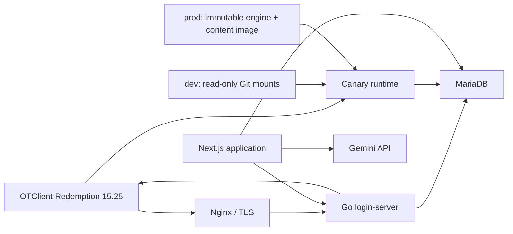

# Undermountain Architecture and Stack Decision

## Status

| Field | Value |
| --- | --- |
| Status | Accepted |
| Decision date | 2026-09-18 |
| Scope | Undermountain fork architecture and service boundaries |
| Base project | OpenTibiaBR Canary |

This document is the canonical record for Undermountain-specific architecture.
The general Canary architecture, development, operations, and Docker guides
remain authoritative for inherited engine behavior and procedures.

## Scope

Undermountain is a custom game built on Canary with a Dungeon of the Mad
Mage-inspired campaign. This decision covers the boundaries among the compiled
Canary engine, versioned game content, the OTClient, authentication, the web
application, Gemini integration, persistence, and deployment.

The Next.js application will live in this repository, but its internal stack,
directory structure, UI architecture, data access layer, and implementation
procedures belong in documentation maintained with that application. This
document defines only its cross-service responsibilities and invariants.

## Product Context

Undermountain needs rapid iteration on maps, encounters, quests, classes, NPCs,
and campaign systems without rebuilding the C++ engine for each content change.
The project also needs a custom website, secure OTClient login, and asynchronous
AI-assisted NPC dialogue without placing network latency on Canary's dispatcher.

The architecture therefore separates the compiled engine from versioned runtime
content while retaining Canary's existing protocol and persistence model.

## Architecture Decision

Undermountain adopts the following architecture:

- Canary remains the C++ game engine.
- OTClient Redemption 15.25 is the initial game client.
- Remere's Map Editor is used to author the map.
- Shared Lua systems live in `data/`.
- Undermountain-specific content lives in `data-canary/`.
- The `dev` profile uses read-only binds for `config.lua`, `data/`, and
  `data-canary/`.
- The `prod` profile uses one immutable image containing engine, configuration,
  and content, with no host bind mounts.
- Content changes require no C++ compilation. Development uses a restart;
  production builds a new lightweight content image.
- C++ or native dependency changes require a new Canary image.
- MariaDB remains the shared persistence service.
- `opentibiabr/login-server` in Go remains the OTClient login service.
- Next.js replaces MyAAC as the website and account management application.
- Next.js owns the Gemini integration and creates its own web sessions.
- Nginx terminates HTTP TLS; the game protocol remains direct TCP traffic.

## Implementation Status

| Capability | Status | Notes |
| --- | --- | --- |
| Minimal `data-canary` datapack | Implemented | Selected by the host `config.lua` |
| Host `config.lua` mount | Implemented | Copied into writable container storage at startup |
| `dev` content mounts | Implemented | `config.lua`, `data/`, and `data-canary/` are read-only |
| `prod` immutable content image | Implemented | Contains `config.lua.dist`, `data/`, and `data-canary/` |
| Resource-limited local builds | Implemented | Launchers use the configured buildx builder explicitly |
| Go login-server | Implemented | Serves the OTClient login API |
| MyAAC website | Current | Will be replaced by Next.js |
| Next.js website and AAC | Accepted | Implementation pending in this repository |
| Gemini inside Next.js | Accepted | Implementation pending |
| Custom Canary image | Conditional | Required only after C++ or native dependency changes |

An accepted item is part of the target architecture even when the corresponding
repository change has not been implemented yet.

## System Topology



Nginx proxies the HTTP login endpoint. After character selection, the OTClient
connects directly to Canary's game protocol port.

## Component Responsibilities

| Component | Responsibility |
| --- | --- |
| Canary C++ | Protocols, dispatcher, scheduler, world simulation, persistence APIs, and Lua APIs |
| `data/` | Shared Lua libraries and reusable gameplay systems |
| `data-canary/` | Map, campaign, encounters, classes, quests, NPCs, monsters, spells, and datapack XML |
| Go login-server | OTClient credential validation, sessions, worlds, and character list responses |
| Next.js | Website, AAC, web sessions, campaign-facing web features, and Gemini integration |
| MariaDB | Shared durable persistence |
| Nginx | HTTP TLS termination and reverse proxying |
| OTClient Redemption | Player interface, client assets, and game protocol |

## Runtime Content Boundary

### Development Mount Contract

The `dev` profile uses the published or custom engine image with repository
content mounted read-only:

```yaml
volumes:
  - '${CANARY_CONFIG_FILE:-../config.lua}:/host-config/config.lua:ro'
  - '../data:/canary/data:ro'
  - '../data-canary:/canary/data-canary:ro'
  - './data/start.sh:/canary/start.sh:ro'
  - 'server-data:/data'
```

The image supplies the compiled engine and native dependencies. The mounts
supply configuration and gameplay content. Runtime-generated backups remain in
the writable `server-data` volume. The versioned `world/custom/` directory must
exist because Canary enumerates it during startup.

### Production Image Contract

The `prod` profile builds `docker/Dockerfile.prod` on top of `CANARY_IMAGE`. The
resulting `CANARY_PROD_IMAGE` contains the versioned `config.lua.dist`, `data/`,
`data-canary/`, schema, RSA key, test seed scripts, and bootstrap. It removes the
unused global datapack and has no host bind mounts. Only `server-data` remains as
a writable volume.

This packaging build does not compile C++. A native engine change first produces
a new `CANARY_IMAGE`; the production packaging build then adds the matching
content snapshot.

### Versioned Content Included

Both delivery modes include:

- The OTBM map and its referenced XML files.
- Shared and datapack-specific Lua scripts.
- Actions, movements, spells, events, creaturescripts, and talkactions.
- Monsters, NPCs, raids, quests, and campaign content.
- Vocation and other datapack XML configuration.
- Reusable core Lua libraries.

Map edits must include the `.otbm` file and every external XML file referenced by
that map. Development reloads them on restart; production includes them in the
next immutable image.

### Database Schema Exception

`schema.sql` initializes an empty database. Changing it and restarting Canary
does not update an existing database. Existing databases must be changed through
explicit migrations. Custom website and campaign tables are owned by the
Next.js application and its migration process; Canary migrations remain owned
by Canary or the datapack.

## Engine Boundary

Gameplay starts in Lua, XML, or the datapack. C++ changes are reserved for
requirements that cannot be implemented safely through existing Lua APIs,
configuration, protocol support, or client assets.

The following changes require a new Canary image:

- Files under `src/`.
- Native dependencies or vcpkg configuration.
- CMake or compiler configuration that changes the executable.
- New protocol behavior or Lua bindings implemented in C++.

A new engine image is consumed directly by `dev` and becomes the base for the
next immutable production image.

## Engine And Content Compatibility

Separating the engine image from content packaging creates a release invariant:

> The production image tag identifies one explicitly validated engine and
> content snapshot from the same Undermountain release.

Deployments must:

- Pin `CANARY_IMAGE` to a tag or digest instead of relying permanently on
  `latest`.
- Tag `CANARY_PROD_IMAGE` with the release or Git revision.
- Build the production image from the matching tracked checkout.
- Roll back production by restoring the previous immutable image tag.

This prevents newer scripts from running against an incompatible engine.

## Authentication Boundary

The Go login-server remains the authority for OTClient credential validation and
the OTClient login response.

Next.js calls the login-server over the internal service network to validate
credentials. The call must originate from the Next.js backend, not directly from
browser code. After successful validation, Next.js creates an independent web
session.

The web session and game session are separate contracts:

- Game passwords and session keys are never stored in a web cookie or JWT.
- The OTClient-specific login payload is not forwarded wholesale to the browser.
- Web cookies are `HttpOnly`, `Secure`, and use an appropriate `SameSite` policy.
- Site authorization is based on the Next.js session.

The current Go login-server authenticates SHA-1 account password hashes. Canary
also supports Argon2id, but changing the account hash contract requires a
coordinated login-server and account migration. Until that occurs, account
creation must remain compatible with the active Go login-server.

## Next.js Boundary

Next.js replaces MyAAC and owns:

- Account and character management interfaces.
- The website and player dashboard.
- Website authentication state and authorization.
- Campaign-facing web features.
- Administration features implemented for Undermountain.
- Gemini integration.

Next.js shares MariaDB with Canary and the login-server, but it must use a
dedicated database user with only the permissions it needs. Its internal stack,
ORM or query layer, module architecture, UI system, tests, and deployment details
are documented with the application itself rather than in this decision.

## Gemini Boundary

Gemini is integrated into the server-side Next.js application.

The integration follows these invariants:

- Gemini credentials exist only in server-side configuration.
- Browser code never calls Gemini directly.
- Next.js owns prompts, request limits, auditing, retries, and persistence.
- Canary's dispatcher never waits for a Gemini network request.
- Long-running interactions cross the Canary boundary through persisted,
  asynchronous work.
- Gemini output may contain dialogue or restricted structured intents.
- Lua validates every gameplay effect before applying it.
- Model-generated Lua, SQL, shell commands, or executable code are never run.
- Gemini failure cannot block movement, combat, login, persistence, or normal NPC
  fallback behavior.

## Database Ownership

MariaDB is shared infrastructure, not shared implementation ownership.

| Data | Owner |
| --- | --- |
| Canary accounts, players, world state, and engine tables | Canary schema and migrations |
| OTClient login sessions and login queries | Go login-server contract |
| Website sessions and site-only data | Next.js migrations |
| Campaign web data and Gemini request state | Next.js migrations |
| Gameplay state consumed by Lua | Canary or datapack migrations |

Cross-component schema changes require explicit compatibility review. No service
may infer that restarting another container applies database changes.

## Deployment Model

```text
dev  = engine image + read-only Git mounts + persistent MariaDB
prod = immutable engine-and-content image + persistent MariaDB
```

Environment-specific public addresses, ports, database credentials, and secrets
remain external configuration in both profiles. Production gameplay
configuration comes from the tracked `config.lua.dist` baked into the image.

Nginx terminates HTTPS for browser and OTClient HTTP login traffic. Ports `8088`
and `9090` stay private when Nginx and internal service networking are available.
The Canary game port, currently `7172`, remains a public TCP endpoint.

## Security Invariants

- Default database, MyAAC, and test credentials are not production credentials.
- Test accounts are disabled or removed before a hardened deployment.
- MariaDB port `3306` and login-server gRPC port `9090` are not public.
- Login-server HTTP port `8088` is restricted behind Nginx when TLS is active.
- The public game port exposes only the Canary game protocol.
- Development content mounts are read-only; production has no content binds.
- Secrets never enter Git-tracked configuration or mounted datapacks.
- Web and game sessions remain separate.
- AI output never bypasses deterministic Lua validation.

## Change Workflows

### Development Content Or Configuration Change

```text
Edit config.lua, data/, or data-canary/
  -> restart the Canary container
  -> validate startup and gameplay
```

No C++ compilation is required.

### Production Content Or Configuration Change

```text
Edit config.lua.dist, data/, or data-canary/
  -> build CANARY_PROD_IMAGE with the limited buildx builder
  -> tag and publish the immutable image
  -> recreate server-prod
  -> validate startup and gameplay
```

This rebuilds only content layers, not the C++ engine.

### C++ Or Native Change

```text
Edit src/ or native build inputs
  -> build and test a new Canary image
  -> tag or pin the image
  -> deploy the matching Git revision and image
  -> recreate the Canary container
  -> validate startup and gameplay
```

### Map Change

```text
Edit with Remere's Map Editor
  -> commit the OTBM and referenced XML files
  -> restart dev or build a new production image
  -> validate towns, spawns, NPCs, houses, movement, and item IDs
```

The editor must use item and client assets compatible with the active Canary and
OTClient release.

## Validation

Architecture conformance is checked by confirming that:

- `dev` mounts `config.lua`, `data/`, and `data-canary/` read-only.
- `prod` has no bind mounts and contains the tracked content snapshot.
- Development content changes are visible after a Canary restart.
- Production content changes create a new immutable image without compiling C++.
- C++ changes produce a new engine image before production packaging.
- Local builds use the configured resource-limited buildx builder.
- OTClient login continues through the Go login-server.
- Next.js creates a separate web session after backend credential validation.
- Gemini calls occur only in Next.js and never on the Canary dispatcher.
- Lua rejects invalid or unauthorized AI intents.
- Public and internal ports match the security invariants.

## Review Triggers

Review this decision when:

- A required game mechanic cannot be expressed safely through Lua or existing
  protocol support.
- Engine and packaged content releases cannot be versioned reliably together.
- The Go login-server changes its password or session contract.
- Next.js requires a cross-service responsibility not defined here.
- Gemini interactions require a different non-blocking persistence boundary.
- OTClient protocol or asset changes alter deployment responsibilities.

## References

- [Canary architecture](architecture.md)
- [Canary development guide](development.md)
- [Canary operations guide](operations.md)
- [Canary Docker quickstart](../docker/DOCKER.md)
- [Docker quickstart for beginners](docker/quickstart-for-beginners.md)
